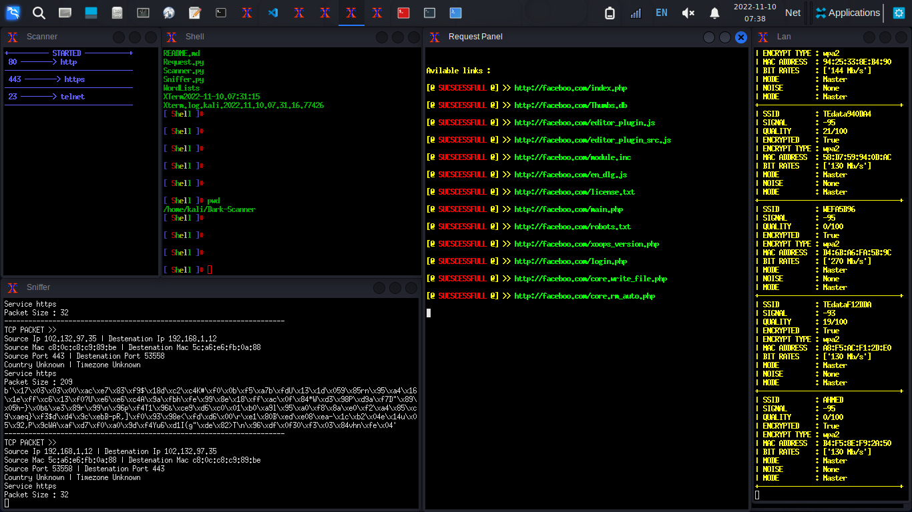
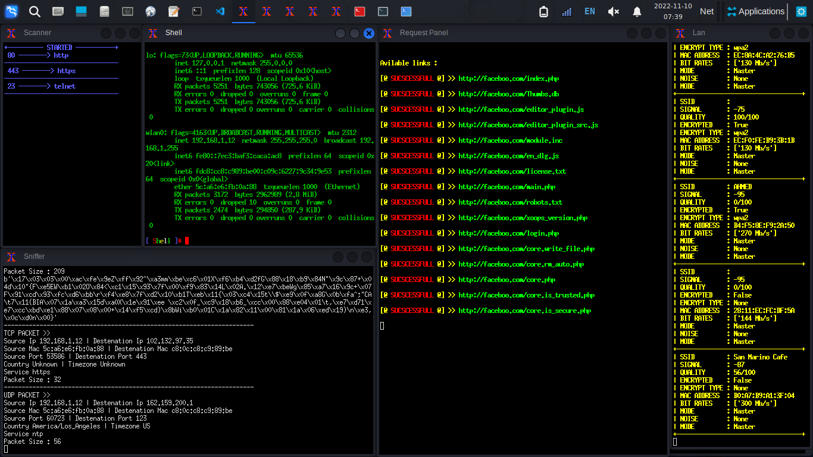
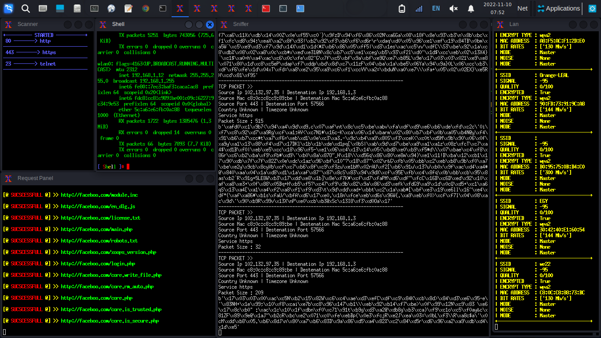

# Dark-Scanner
This Is A Scanner And Sniffer And Shell . 
#### Installation :
- >   apt install python3 
- >   apt install git 
- >   git clone https://github.com/hackerone4x/Dark-Scanner
- >   cd Dark-SCanner
- >   python3 -m pip install geoip scapy socket subproccess
- >   sudo python3 main.py
________________________________________________________________________________________________________________________________________________ 
#### Useage :
- >     sudo python3 sniffer.py  And Enter Command  
 _______________________________________________________________________________________________________________________________________________
 

 
 _______________________________________________________________________________________________________________________________________________

 _______________________________________________________________________________________________________________________________________________

 _______________________________________________________________________________________________________________________________________________
 

